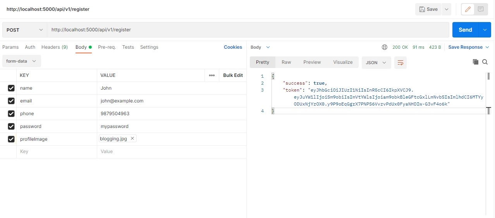
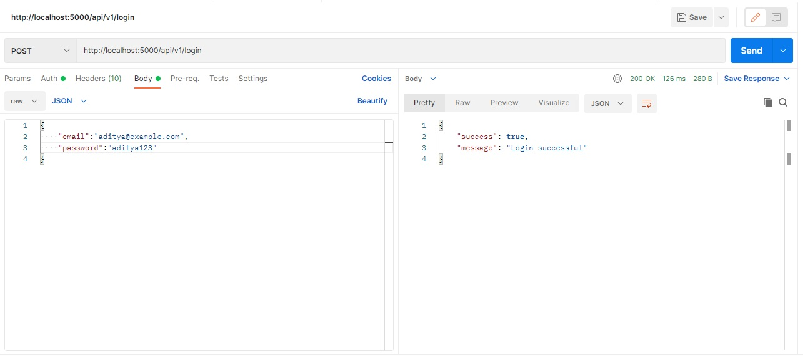
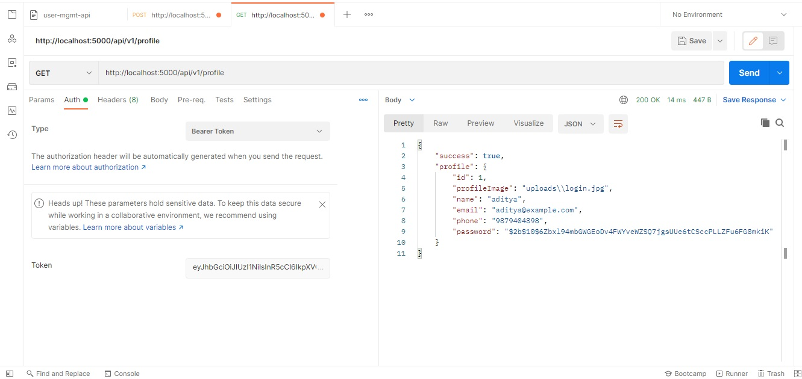
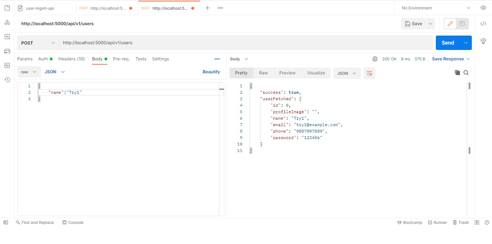
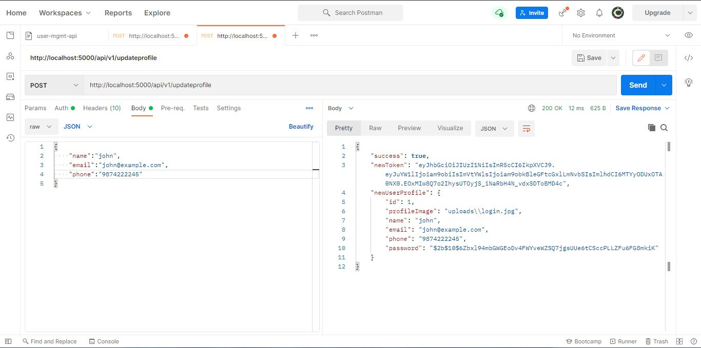
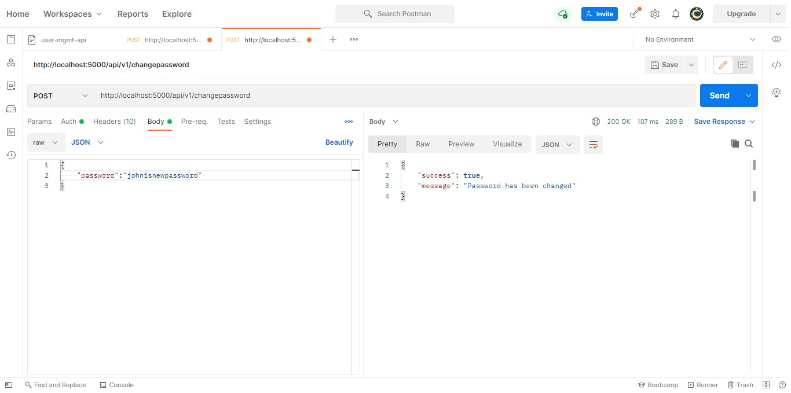

# Basic User Management API  
A sample node js api for registering user, authenticating login and updating the user information with a REST API using NodeJS.     

### Clone the repository, install node packages and the dependencies

``` 
//on local
git clone https://github.com/zowe/sample-node-api
cd sample-node-api
npm install
npm start
```
Install the following dependencies: 
```
"dependencies": {
    "bcrypt": "^5.0.1",
    "dotenv": "^10.0.0",
    "express": "^4.17.1",
    "fs": "0.0.1-security",
    "jsonwebtoken": "^8.5.1",
    "multer": "^1.4.3"
 }
 
 ```
Access the api with the following url:
```
url: http://localhost:5000/api/v1/route_name
PORT=5000 by default can change in .env file
```
**API Catalog**


















